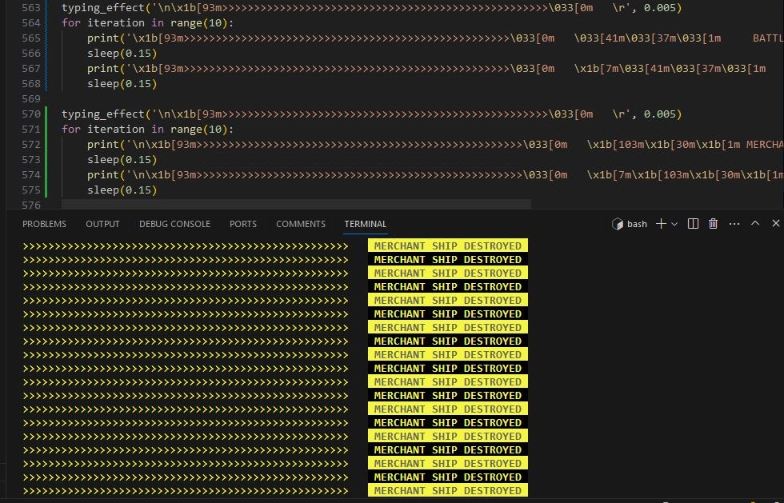
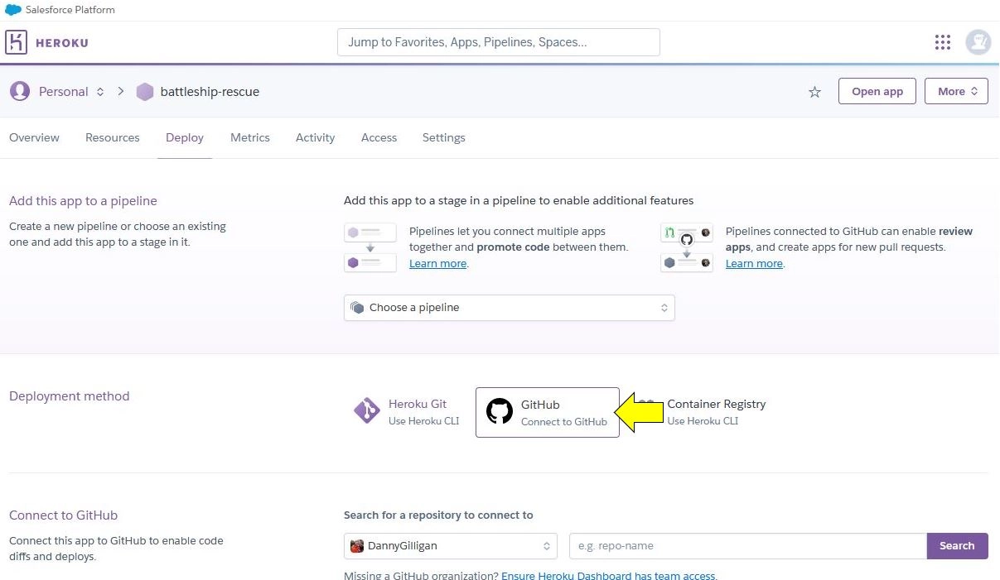

# Battleship Rescue

 
 
 

## Table of Contents

* [Introduction](#introduction)
* [Features](#features)
* [Process Flows](#process-flows)
* [User Stories](#user-stories)
* [Bugs](#bugs)
* [Manual Testing](#manual-testing)
* [Deployment](#deployment)
* [Technologies Used](#technologies-used)
* [Credits](#credits)
* [Acknowledgements](#acknowledgements)
 
 
 

## Introduction

[Back to Top](#battleship-rescue)
 
 
 

## Features

A summary of the main features of the game is shown below.

 

  
<b>Existing Features</b>

 

  
 <i>Banner Art</i>

 

The user is provided with a visually interesting 'start screen' including ASCII banner art and tag lines giving context to the game.

The ASCII art was generated by [patorjk.com](https://patorjk.com/software/taag/#p=display&f=Graffiti&t=Type%20Something%20)

 

 

  
 <i>Input Validation</i>

 

Input validation is used throughout the game wherever the user is asked to interact with the program.
These inputs will be checked, and whenever they are invalid, an alert will be displayed emphasising what the requirements are.

 

 

  
 <i>Difficulty Levels</i>

 

The user is able to select from different difficulty levels to play the game. 

Each difficulty level will initialise the game with different starting variables (e.g number of torpedos, enemy ships etc)

 

 

  
 <i>Narrative</i>

 

A narrative has been created for the game, depicting a scenario where the user is in command of the last battleship in a war that is doomed to be lost unless the user can protect several merchant ships that are rushing to deliver cargo that will turn the tide of events.
 
 
The narrative also subtly introduces the game mechanics to the user, and attempts to provide immersion for the user, which in turn will provide a more enjoyable user experience.
  
It should be noted, that although the narrative is completely fictional and cursory in nature, it tries to pack a punch in the few lines available. As it depicts scenarios of warfare, it may not be suitable for all audiences. As such. the game is aimed at adults instead of a younger audience.
  

 

  
 <i>SITREP Display</i>

 

The SITREP display, or 'situation report', is the main source of information displayed to the user during the game. An overview of the different fields is shown below.
  
<b>Torpedos remaining</b>: The current number of torpedos available to the user, if this is less than the enemy ships remaining, the game mission will fail.
  
<b>Hull plates remaining</b>: The current number of hull plates on the user's battleship, this is decremented with each enemy hit. If it reaches zero, the mission will fail.
  
<b>Enemy ships remaining</b>: The current number of enemy ships afloat. This is decremented with each successful user hit. If it reaches zero, the mission will succeed.
  
<b>Merchant ships remaining</b>: The current number of merchant ships afloat. This is decremented with each accidental user hit, and successful enemy hit. If it reaches zero, the mission will fail.
  
<b>Missed shots</b>: The current number of shots missed by the user.
  
<b>Shot accuracy</b>: This is a current statistic of the user's accuracy (enemy ships destroyed / total user shots, expressed as a percentage).
  
<b>Enemy ships destroyed</b>: The current number of enemy ships destroyed by the user.
  
<b>Merchant ships destroyed</b>: The current number of merchant ships destroyed, by both the user and the enemy (computer).
  

 

  
 <i>Battle Grid</i>

 

The battle grid is a graphical representation of a 2D nested list containing the coordinates used in the game. This list will initially hold a default '~' symbol to represent each coordinate. 
  
As the user progresses through the game, each coordinate will be updated after each shot with either a miss symbol 'X', enemy ship destroyed symbol 'E' or a merchant ship destroyed symbol 'M'.
  
To note, when either an enemy ship or merchant ship destroyed symbol is displayed, it will not be overwritten with an 'X' symbol if the user chooses to fire upon those same coordinates again.
  
The battle grid is a 7 x 7 grid by default. A decision was made not to make it variable in size at the time of deployment, this was due to the impact on the positioning of other elements around the battle grid. The ability to allow the user to change the size of the grid has been included as a future feature to be implemented.
  

 

  
 <i>Battleship Weapons</i>

 

The user's role is to direct and fire the primary weapon of the battleship, in the narrative, this is described as the 'Sea Stiletto' nuclear torpedo. 
  
To fire the weapon, the coordinates are entered into the input fields when the 'Weapons Ready' alert is displayed, these coordinates are validated and once accepted, they will be registered on the battle grid.
  

 

  
 <i>Enemy Weapons</i>

 

Once the user has fired a torpedo, the enemy will then be given an opportunity to return fire. This involved automatically generating a random set of coordinates within the constraints of the battle grid.
  
The enemy's shot will then be checked against the user's 'hull plate locations' and also the merchant ship locations, either of which will be decremented if the enemy shot is successful.
  

 

  
 <i>Shot Feedback</i>

 

After each shot is taken, either by the user's battlehip or the enemy, immediate feedback is provided with a quick animation.
  
Color is used here to provide a visually interesting feature and enhance the user experience.
  
A summary of the different shot feedback messages is shown below.
  

 

  
 <i>Battle Update (Success)</i>

 

If the user is able to sink all the enemy ships within the game constraints, a 'Battle Update' will be displayed giving immediate feedback on the mission's success.
  
This will be accompanied by a narrative giving more details on the outcome.
  

 

  
 <i>Battle Update (Failed)</i>

 

There is only one way to win the game, however, there are several to lose!
  
If the user's torpedos run out or if the number drops below the number of enemy ships afloat, the mission will fail.
  
If the user's hull plates run out, the mission will fail.
  
If the number of merchant ships afloat reaches zero, the mission will fail.
  
If any of the failure conditions are met, a 'Battle Update' will be displayed to the user providing immediate feedback on the mission failure. This will be accompanied by a narrative giving more details on the outcome.
  

 

 
 

  
<b>Future Features</b>

 

  
 <i>Battleship: Vengeance</i>

 
If the user completes the mission in 'Battleship: Rescue' successfully, the narrative leads up to an abrupt change in the direction of the war.
  
This allows a natural sequel mission to be developed, perhaps in the form of a timed mission where the user has to destroy as many enemy ships as possible, this would have a points scoring system, with different classes of enemy ships having different scores associated with them. Destroying certain types of ships would grant the user extra time.  Also, at stages during the timed mission, the enemy could call in reinforcements which would appear on the battle grid on coordinates that were previously marked as 'missed shots'.
  

  
 <i>Battleship: Infiltrate</i>

 
This feature would be another mission, where the user would navigate the battle grid while trying to stay out of the 'radar zone' of enemy ships.  The enemy ships would be hidden from the user, however, the user would have a certain amount of attempts to deploy an EMP pulse that would disable the enemy's radars and make them visible on the battle grid for a brief amount of time.  The mission would be successful once the user navigates the battleship to a designated point on the battle grid.
  

  
 <i>Skip Text</i>

 
The game makes use of a 'typing effect' function (code credited in the 'Reference Materials Used' section). I personally really like the effect, but some users may prefer to have the option to skip the text and make it appear instantly.  This will be a feature that will be included in a future update.
  

  
 <i>Game Variables</i>

 
The game in its current state is very challenging, even at the lowest difficulty level.  User feedback will be requested to gauge if players are enjoying the game, and what variables may need to be adjusted to provide a more positive playing experience, e.g, grid size, torpedo counts, enemy ships etc. 
  

  
 <i>External Libraries</i>

 
To improve the user experience, it may be possible to use libraries such as 'Rich' and 'Colorama' to provide a more visually appealing interface.
  

 
 

[Back to Top](#battleship-rescue)
 
 
 

## Process Flows

The diagrams below represent the process flows throughout the main phases of the game. These are subject to change during the development phase of the game (best viewed in raw format).

 

  
<b>Phase 1: Initialise Game</b>

 

  
<b>Phase 2: User Shot</b>

 

  
<b>Phase 3: Enemy Shot</b>

 

  
<b>Phase 4: End Game</b>

 

[Back to Top](#battleship-rescue)
 
 
 

## User Stories 

The user stories relating to this MVP version of the game, from the perspective of both a user and a developer, are outlined below.
  
<!-- 'As a user' User Stories are shown below -->

  
<b>As a User</b>

 
<table>
<tr>
<th>User Story</th><th>Result</th>
</tr>
<!-- User Story 1 begins -->
<tr>
<td>I am presented with a clear, organised start screen with game logo</td><td>:heavy_check_mark:</td>
</tr>
<!-- User Story 1 ends -->
<tr>
<td>I can enter a username<td>:heavy_check_mark:</td>
</tr>
<!-- spacer -->
<tr>
<td>If the username I submit is invalid, I am alerted to this and the requirements are emphasised to me</td><td>:heavy_check_mark:</td>
</tr>
<!-- spacer -->
<tr>
<td>I am presented with difficulty levels to choose from</td><td>:heavy_check_mark:</td>
</tr>
<!-- spacer -->
<tr>
<td>If I enter an incorrect difficulty level, I am alerted to this and the requirements are emphasised to me</td><td>:heavy_check_mark:</td>
</tr>
<!-- spacer -->
<tr>
<td>I am presented with a narrative providing a back story to the game and mission details</td><td>:heavy_check_mark:</td>
</tr>
<!-- spacer -->
<tr>
<td>I can choose to accept or reject the mission</td><td>:heavy_check_mark:</td>
</tr>
<!-- spacer -->
<tr>
<td>If I enter the wrong input at the mission accept screen, I am alerted to this and the requirements are emphasised to me</td><td>:heavy_check_mark:</td>
</tr>
<!-- spacer -->
<tr>
<td>If I choose to reject the mission, I am provided with a confirmation message</td><td>:heavy_check_mark:</td>
</tr>
<!-- spacer -->
<tr>
<td>When I choose to accept the mission, I am presented with a sitrep display providing details of the battleship</td><td>:heavy_check_mark:</td>
</tr>
<!-- spacer -->
<tr>
<td>I am presented with a clear, organised game screen giving an overview of the information related to the battle</td><td>:heavy_check_mark:</td>
</tr>
<!-- spacer -->
<tr>
<td>I can clearly see how many torpedos are remaining</td><td>:heavy_check_mark:</td>
</tr>
<!-- spacer -->
<tr>
<td>I can clearly see how many hull plates are remaining</td><td>:heavy_check_mark:</td>
</tr>
<!-- spacer -->
<tr>
<td>I can clearly see how many enemy ships are remaining</td><td>:heavy_check_mark:</td>
</tr>
<!-- spacer -->
<tr>
<td>I can clearly see how many merchant ships are remaining</td><td>:heavy_check_mark:</td>
</tr>
<!-- spacer -->
<tr>
<td>I can clearly see how many shot I've missed</td><td>:heavy_check_mark:</td>
</tr>
<!-- spacer -->
<tr>
<td>I can clearly see my shot accuracy</td><td>:heavy_check_mark:</td>
</tr>
<!-- spacer -->
<tr>
<td>I can clearly see how many enemy ships have been destroyed</td><td>:heavy_check_mark:</td>
</tr>
<!-- spacer -->
<tr>
<td>I can clearly see how many merchant ships have been destroyed</td><td>:heavy_check_mark:</td>
</tr>
<!-- spacer -->
<tr>
<td>I am presented with a clear, organised 'battle grid' with rows and columns clearly identified</td><td>:heavy_check_mark:</td>
</tr>
<!-- spacer -->
<tr>
<td>I can clearly see the 'weapons ready' message</td><td>:heavy_check_mark:</td>
</tr>
<!-- spacer -->
<tr>
<td>I can clearly see where to enter the input for the row to fire upon</td><td>:heavy_check_mark:</td>
</tr>
<!-- spacer -->
<tr>
<td>If I enter an incorrect row input, I am alerted to this and the requirements are emphasised to me</td><td>:heavy_check_mark:</td>
</tr>
<!-- spacer -->
<tr>
<td>I can clearly see where to enter the input for the column to fire upon</td><td>:heavy_check_mark:</td>
</tr>
<!-- spacer -->
<tr>
<td>If I enter an incorrect column input, I am alerted to this and the requirements are emphasised to me</td><td>:heavy_check_mark:</td>
</tr>
<!-- spacer -->
<tr>
<td>I am provided with immediate feedback if my shot was a miss</td><td>:heavy_check_mark:</td>
</tr>
<!-- spacer -->
<tr>
<td>I am provided with immediate feedback if my shot destroyed an enemy ship</td><td>:heavy_check_mark:</td>
</tr>
<!-- spacer -->
<tr>
<td>I am provided with immediate feedback if my shot destroyed a merchant ship</td><td>:heavy_check_mark:</td>
</tr>
<!-- spacer -->
<tr>
<td>I am alerted when the enemy is firing upon my battleship</td><td>:heavy_check_mark:</td>
</tr>
<!-- spacer -->
<tr>
<td>I am provided with immediate feedback if the enemy shot hit my battleship</td><td>:heavy_check_mark:</td>
</tr>
<!-- spacer -->
<tr>
<td>I am provided with immediate feedback if the enemy shot missed</td><td>:heavy_check_mark:</td>
</tr>
<!-- spacer -->
<tr>
<td>I am provided with a battle update and mission status overview upon failing the mission</td><td>:heavy_check_mark:</td>
</tr>
<!-- spacer -->
<tr>
<td>I am provided with a narrative when the mission fails</td><td>:heavy_check_mark:</td>
</tr>
<!-- spacer -->
<tr>
<td>I am provided with a battle update and mission status overview upon accomplishing the mission</td><td>:heavy_check_mark:</td>
</tr>
<!-- spacer -->
<tr>
<td>I am provided with a narrative when the mission succeeds</td><td>:heavy_check_mark:</td>
</tr>
<!-- spacer -->
<tr>
<td>I can choose to restart the game from the end game screen</td><td>:heavy_check_mark:</td>
</tr>
<!-- spacer -->
<tr>
<td>I can choose to exit the game from the end game screen</td><td>:heavy_check_mark:</td>
</tr>
<!-- spacer -->

</table>

[Back to User Stories](#user-stories)
 
 
 

<!-- 'As a User' User Stories end here -->
<!-- 'As a Developer' User Stories are shown below -->

  
<b>As a Developer</b>

 
<table>
<tr>
<th>User Story</th><th>Result</th>
</tr>
<!-- spacer -->
<tr>
<td>I am presented with a clean, organised repository to work with</td><td>:heavy_check_mark:</td>
</tr>
<!-- spacer -->
<tr>
<td>I am provided with docstrings and relevant comments in the run.py file</td><td>:heavy_check_mark:</td>
</tr>
<!-- spacer -->
<tr>
<td>I am provided with a validated PEP8 compliant code base in the run.py file</td><td>:heavy_check_mark:</td>
</tr>
<!-- spacer -->
<tr>
<td>I am provided with a clear, organised README.md file</td><td>:heavy_check_mark:</td>
</tr>
<!-- spacer -->
<tr>
<td>I am provided with detailed instructions on the deployment steps</td><td>:heavy_check_mark:</td>
</tr>
<!-- spacer -->
</table>

[Back to User Stories](#user-stories)
 
 
 

<!-- User Stories section ends here -->

[Back to Top](#battleship-rescue)
 
 
 

## Bugs

  
<b>Resolved Bugs</b>

  

  
 <i>Banner Art PEP8 Errors</i>

 

<table>
<tr><th>Banner Art PEP8 Errors</th><th>Status</th></tr>

<tr>
<td>
 
When adding the banner art, I encountered several warnings in the Code Institute python linter. I researched online, and one option was to print the banner art in a 'raw' format, however, due to the design of the art, this was not an optimal solution. There are three horizontal lines in the center of the banner art that I needed to use coloured text for, and also, I wanted them to be animated using the typing effect function.
  
</td>
<td rowspan="6">
:heavy_check_mark:
</td>
</tr>

<tr>
<td>

</td>
</tr>

<tr>
<td>
 
The eventual solution was to split the banner art into three separate variables and print them individually to the console as needed.
  
</td>
</tr>

<tr>
<td>

</td>
</tr>

<tr>
<td>
 
This solution solved the issue in the Code Institute python linter.
  
</td>
</tr>

<tr>
<td>

</td>
</tr>
</table>

<!-- Banner art bug ends here -->
<!-- PEP8 validation bug starts here -->

  
 <i>2D List PEP8 Errors</i>

 

<table>
<tr><th>2D List PEP8 Errors</th><th>Status</th></tr>

<tr>
<td>
 
Another validation error that I found tricky initially related to the 2D nested list that would contain the battle grid. It took several attempts to find the right format that would be considered valid by the python linter.
  
</td>
<td rowspan="4">
:heavy_check_mark:
</td>
</tr>

<tr>
<td>

</td>
</tr>

<tr>
<td>
 
I was eventually able to find the right indentation levels for each list, within the outer list.
  
</td>
</tr>

<tr>
<td>

</td>
</tr>
</table>

  
 <i>Feedback Animation</i>

 

<table>
<tr><th>Feedback Animation</th><th>Status</th></tr>

<tr>
<td>
 
I initially enountered issues with getting the shot feedback animation to behave as expected, this animation involves printing text to the console, then flushing or overwriting that text using the carriage return escape character. However, I had overlooked this and included a new line escape character which resulted in several lines being printed, instead of just the one line being overwritten. The bug was resolved and behaves as expected in the deployed app.
  
</td>
<td rowspan="2">
:heavy_check_mark:
</td>
</tr>

<tr>
<td>

</td>
</tr>

</table>

  
 <i>Shot Recognition</i>

 

<table>
<tr><th>Shot Recognition</th><th>Status</th></tr>

<tr>
<td>
 
I also experienced problems with registering the user and enemy shots on the battle grid. To solve the problem I used the 'type' method to determine what the computer was 'seeing'. This revealed that although the user input looked identical to what was expected, there were two different data types at play.
  
</td>
<td rowspan="4">
:heavy_check_mark:
</td>
</tr>

<tr>
<td>

</td>
</tr>

<tr>
<td>
 
Once I had this information, I was able to amend the user shot variable and the inputs to create a 'shot' that would match the coordinates in the enemy ship list exactly. This resolved the issue.
  
</td>
</tr>

<tr>
<td>

</td>
</tr>

</table>

[Back to Top](#battleship-rescue)
 
 
 

## Manual Testing

Several manual tests were performed during playthroughs of the game. The results of which are outlined below.
  
<!-- Manual tests are shown below -->

  
<b>Manual Testing</b>

 
<table>
<tr>
<th>Manual Test Scenario</th><th>Result</th>
</tr>
<!-- spacer -->
<tr>
<td>Banner art displays correctly on start screen</td><td>:heavy_check_mark:</td>
</tr>
<!-- spacer -->
<tr>
<td>Tag lines display correctly on start screen<td>:heavy_check_mark:</td>
</tr>
<!-- spacer -->
<tr>
<td>Enter call sign prompt, with requirements highlighted, displays correctly</td><td>:heavy_check_mark:</td>
</tr>
<!-- spacer -->
<tr>
<td>When call sign does not meet requirements, alert is displayed correctly</td><td>:heavy_check_mark:</td>
</tr>
<!-- spacer -->
<tr>
<td>Mission difficulty screen displays correctly, with options clearly visible</td><td>:heavy_check_mark:</td>
</tr>
<!-- spacer -->
<tr>
<td>When incorrect mission difficulty option is entered, alert is displayed correctly</td><td>:heavy_check_mark:</td>
</tr>
<!-- spacer -->
<tr>
<td>Cadet, Captain and Admiral difficulty options are recognised and accepted as valid inputs</td><td>:heavy_check_mark:</td>
</tr>
<!-- spacer -->
<tr>
<td>Connection to 'Central Command' animation displays correctly</td><td>:heavy_check_mark:</td>
</tr>
<!-- spacer -->
<tr>
<td>Back story and mission details screen is displayed correctly</td><td>:heavy_check_mark:</td>
</tr>
<!-- spacer -->
<tr>
<td>Prompt to accept mission, with input requirements clearly visible, is displayed correctly</td><td>:heavy_check_mark:</td>
</tr>
<!-- spacer -->
<tr>
<td>If invalid input is entered for the accept mission prompt, alert is displayed correctly</td><td>:heavy_check_mark:</td>
</tr>
<!-- spacer -->
<tr>
<td>If mission is rejected, message and confirmation is displayed correctly</td><td>:heavy_check_mark:</td>
</tr>
<!-- spacer -->
<tr>
<td>When mission is accepted, the sitrep module loading screen is displayed correctly </td><td>:heavy_check_mark:</td>
</tr>
<!-- spacer -->
<tr>
<td>The sitrep display screen is then displayed correctly</td><td>:heavy_check_mark:</td>
</tr>
<!-- spacer -->
<tr>
<td>All initial game values in the sitrep display are presented correctly</td><td>:heavy_check_mark:</td>
</tr>
<!-- spacer -->
<tr>
<td>The battle grid is displayed correctly with default symbols and row and columns clearly identified</td><td>:heavy_check_mark:</td>
</tr>
<!-- spacer -->
<tr>
<td>The weapons ready message is displayed correctly</td><td>:heavy_check_mark:</td>
</tr>
<!-- spacer -->
<tr>
<td>The input to accept row to fire upon is displayed correctly<td>:heavy_check_mark:</td>
</tr>
<!-- spacer -->
<tr>
<td>If an invalid row input is entered, the alert is displayed correctly</td><td>:heavy_check_mark:</td>
</tr>
<!-- spacer -->
<tr>
<td>The input to accept column to fire upon is displayed correctly</td><td>:heavy_check_mark:</td>
</tr>
<!-- spacer -->
<tr>
<td>If an invalid column input is entered, the alert is displayed correctly</td><td>:heavy_check_mark:</td>
</tr>
<!-- spacer -->
<tr>
<td>The shot feedback animation displays correctly</td><td>:heavy_check_mark:</td>
</tr>
<!-- spacer -->
<tr>
<td>The sitrep panel data updates correctly if the shot is a miss</td><td>:heavy_check_mark:</td>
</tr>
<!-- spacer -->
<tr>
<td>The sitrep panel data updates correctly if the shot is an enemy hit</td><td>:heavy_check_mark:</td>
</tr>
<!-- spacer -->
<tr>
<td>The sitrep panel data updates correctly if the shot is a merchant ship hit</td><td>:heavy_check_mark:</td>
</tr>
<!-- spacer -->
<tr>
<td>The sitep panel updates the shot accuracy percentage correctly after each user shot</td><td>:heavy_check_mark:</td>
</tr>
<!-- spacer -->
<tr>
<td>The enemy torpedo in the water alert displays correctly</td><td>:heavy_check_mark:</td>
</tr>
<!-- spacer -->
<tr>
<td>The enemy shot feedback animation displays correctly</td><td>:heavy_check_mark:</td>
</tr>
<!-- spacer -->
<tr>
<td>The sitrep panel updates correctly if the enemy shot hits the user's battleship</td><td>:heavy_check_mark:</td>
</tr>
<!-- spacer -->
<tr>
<td>The loop behaves as expected and requests another user shot after enemy shot is processed</td><td>:heavy_check_mark:</td>
</tr>
<!-- spacer -->
<tr>
<td>The battle grid is updated correctly with an 'X' symbol if the user shot misses</td><td>:heavy_check_mark:</td>
</tr>
<!-- spacer -->
<tr>
<td>The battle grid is updated correctly with an 'E' symbol if the user shot destroys an enemy ship</td><td>:heavy_check_mark:</td>
</tr>
<!-- spacer -->
<tr>
<td>The battle grid is updated correctly with an 'M' symbol if the user shot destroys an enemy ship</td><td>:heavy_check_mark:</td>
</tr>
<!-- spacer -->
<tr>
<td>The battle grid does not overwrite an 'E' or 'M' symbol with 'X' if user fires on same coordinates</td><td>:heavy_check_mark:</td>
</tr>
<!-- spacer -->
<tr>
<td>All variations of shot inputs from row 0 column 0 to row 6 column 6 are accepted</td><td>:heavy_check_mark:</td>
</tr>
<!-- spacer -->
<tr>
<td>The game ends as expected when the user's torpedo count is less then the enemy ships remaining, resulting in mission failure</td><td>:heavy_check_mark:</td>
</tr>
<!-- spacer -->
<tr>
<td>The game ends as expected when the user's hull plates remaining reaches 0, resulting in mission failure</td><td>:heavy_check_mark:</td>
</tr>
<!-- spacer -->
<tr>
<td>The game ends as expected when the merchant ships remaining reaches 0, resulting in mission failure</td><td>:heavy_check_mark:</td>
</tr>
<!-- spacer -->
<tr>
<td>The game ends as expected when the enemy ships reaches 0, resulting in mission success</td><td>:heavy_check_mark:</td>
</tr>
<!-- spacer -->
<tr>
<td>The mission failure narrative displays correctly</td><td>:heavy_check_mark:</td>
</tr>
<!-- spacer -->
<tr>
<td>User can restart game successfully from mission failure narrative screen</td><td>:heavy_check_mark:</td>
</tr>
<!-- spacer -->
<tr>
<td>User can exit program successfully from mission failure narrative screen</td><td>:heavy_check_mark:</td>
</tr>
<!-- spacer -->
<tr>
<td>User can restart game successfully from mission success narrative screen</td><td>:heavy_check_mark:</td>
</tr>
<!-- spacer -->
<tr>
<td>User can exit program successfully from mission success narrative screen</td><td>:heavy_check_mark:</td>
</tr>
<!-- spacer -->

</table>

[Back to Manual Testing](#manual-testing)

 
 
 

  
<b>Code Validation</b>

 

The python code passed through the [Code Institute Python PEP8 Linter](https://pep8ci.herokuapp.com/#) without returning any warnings or errors.

 
<table>
<tr><td><b>Code Institute Linter</b></td><td><b>Status</b></td></tr>

</tr>
<td>

</td>
<td>
:heavy_check_mark:
</td>
</tr>
</table>

[Back to Top](#battleship-rescue)
 
 
 

## Deployment

The app was deployed as a Minimum Viable Product using the Heroku platform.

  
<b>The steps for deployment are outlined here</b>

 

<!-- spacer -->

  
<i> Step 1: Create app</i>

 
In the Heroku dashboard, populate the 'App name' field and choose a region. Then click on 'Create app'.
 
 
<table>
<tr>
<td>

</td>
</table>

<!-- spacer -->

  
<i> Step 2: App setup page</i>

 
Once the app is created, the setup page will be displayed. This page contains an overview of the data related to the app. From here, navigate to the 'Settings' tab.
 
 
<table>
<tr>
<td>

</td>
</table>

<!-- spacer -->

  
<i> Step 3: Settings</i>

 
On the Settings page, click on the 'Reveal Config Vars' button.
 
 
<table>
<tr>
<td>

</td>
</table>

<!-- spacer -->

  
<i> Step 4: Config vars</i>

 
In the Config Vars, add 'PORT' and '8000' in the fields as shown below. Then click 'Add'.
 
 
<table>
<tr>
<td>

</td>
</table>

<!-- spacer -->

  
<i> Step 5: Add buildpacks</i>

 
Once the Config Vars are added, the next step is to add two buildpacks to the app. Scroll down to the Buildpacks section and click on the 'Add buildpack' button.
 
 
<table>
<tr>
<td>

</td>
</table>

<!-- spacer -->

  
<i> Step 6: Add python buildpack</i>

 
Select the python option from the menu, then click 'Add buildpack'. To note, it is important that the python buildpack is added first <b>before</b> any other buildpack!
 
 
<table>
<tr>
<td>

</td>
</table>

<!-- spacer -->

  
<i> Step 7: Add node.js buildpack</i>

 
Once the python buildpack is added, select the node.js buildpack from the menu and click on the 'Add buildpack' button. To note, it is important that the node.js buildpack is added <b>after</b> the python buildpack!
 
 
<table>
<tr>
<td>

</td>
</table>

<!-- spacer -->

  
<i> Step 8: Deploy screen</i>

 
Once the buildpacks have been added (python, followed by node.js), navigate to the 'Deploy' tab.
 
 
<table>
<tr>
<td>

</td>
</table>

<!-- spacer -->

  
<i> Step 9: Select Github</i>

 
Select Github from the 'Deployment method' options.
 
 
<table>
<tr>
<td>

</td>
</table>

<!-- spacer -->

  
<i> Step 10: Enter repository name</i>

 
Enter the repository name in the 'Connect to Github' field as shown below, then click on the 'Seach' button.
 
 
<table>
<tr>
<td>

</td>
</table>

<!-- spacer -->

  
<i> Step 11: Connect</i>

 
Once the repository has been located, click on the 'Connect' button.
 
 
<table>
<tr>
<td>

</td>
</table>

<!-- spacer -->

  
<i> Step 12: Connection confirmation</i>

 
A confirmation will be displayed on the Github once the repository is connected to the Heroku app as shown below.
 
 
<table>
<tr>
<td>

</td>
</table>

<!-- spacer -->

  
<i> Step 13: Enable automatic deploys (optional)</i>

 
Automatic deploys can be enabled if so desired by clicking on the 'Enable Automatic Deploys' button, this will result in the app being refreshed with updated code every time changes are pushed to Github. 
 
 
<table>
<tr>
<td>

</td>
</table>

<!-- spacer -->

  
<i> Step 14: Manual deployment</i>

 
The initial deployment of the app can be triggered by selecting 'main' from the 'Choose a branch to deploy' menu, then clicking on the 'Deploy Branch' button.
 
 
<table>
<tr>
<td>

</td>
</table>

<!-- spacer -->

  
<i> Step 15: Deployment confirmation</i>

 
Once the app build and deployment has been completed in Heroku, a confirmation will be displayed as shown below. The app can now be viewed by clicking on the 'View' button.
 
 
The deployment process is now complete.
 
 
The live link to the app is https://battleship-rescue-4a195bb43cc9.herokuapp.com/
 
 
<table>
<tr>
<td>

</td>
</table>

<!-- spacer -->

The live link to the app is https://battleship-rescue-4a195bb43cc9.herokuapp.com/

[Back to Top](#battleship-rescue)
 
 
 

## Technologies Used

#### 
<table>
<tr><th>Logo</th><th>Name</th><th>Primary Role</th><th>Link</th></tr>
<!-- Technology Used 1 begins -->
<tr><td>

	<code></code>

</td>
<td>Python</td>
<td>Coding language</td>
<td>https://docs.python.org/3/</td>
</tr>
<!-- Technology Used 1 ends -->
<tr><td>

	<code></code>

</td>
<td> Code Institute Python Linter  </td>
<td>Python PEP8 validation</td>
<td>https://pep8ci.herokuapp.com/#</td>
</tr>
<!-- spacer -->
<tr><td>

	<code></code>

</td>
<td>Balsamiq</td>
<td>Process flows</td>
<td>https://balsamiq.com/docs/</td>
</tr>
<!-- spacer -->
<tr><td>

	<code></code>

</td>
<td>Github</td>
<td>Site repository</td>
<td>https://docs.github.com/en</td>
</tr>
<!-- spacer -->
<tr><td>

	<code></code>

</td>
<td>Gitpod</td>
<td>Site development, IDE</td>
<td>https://www.gitpod.io/docs/introduction</td>
</tr>
<!-- spacer -->
<tr><td>

	<code></code>

</td>
<td>Coffee</td>
<td>Soul regeneration</td>
<td>https://en.wikipedia.org/wiki/Coffee</td>
</tr>
<!-- spacer -->
<tr><td>

	<code></code>

</td>
<td>Google</td>
<td>First officer</td>
<td>https://www.google.com/</td>
</tr>
<!-- spacer -->
</table>
<!-- Technologies Used section ends here -->

[Back to Top](#battleship-rescue)
 
 
 

## Credits
 

  
<b>Reference Materials Used</b>

 

<table>
<tr><th><b> Description </b></th><th><b> Link </b></th></tr>
<!-- Reference Material 1 begins -->
<tr><td> Code Institute README.md Tutorial, by Kasia Bogucka </td>
<td> 

[here](https://www.youtube.com/watch?v=l1DE7L-4eKQ)  

</td></tr>
<!-- Reference Material 1 ends -->
<tr><td> Guide to Milestone 3 MVP, by Kasia Bogucka </td>
<td> 

[here](https://www.youtube.com/watch?v=nNXmC6Tq0qw)  

</td></tr>
<!-- Spacer -->
<tr><td> Guide on code validation, by Lane-Sawyer Thompson & Matt Rudge </td>
<td> 

[here](https://www.youtube.com/watch?v=wiqAvRCheKo)  

</td></tr>
<!-- Spacer -->
<tr><td> Milestone 3 Project FAQs, by Lane-Sawyer Thompson & Lucy Rush </td>
<td> 

[here](https://www.youtube.com/watch?v=BDKvisxzEbk)  

</td></tr>
<!-- Spacer -->
<tr><td> Python Essentials LMS content, published by Code Institute </td>
<td> 

[here](https://codeinstitute.net/nl/)  

</td></tr>
<!-- Spacer -->
<tr><td> Typing effect code, by Stackoverflow user Julian E. </td>
<td> 

[here](https://stackoverflow.com/questions/20302331/typing-effect-in-python)  

</td></tr>
<!-- Spacer -->
<tr><td> Battleships YouTube Tutorial, published by Dr. Codie </td>
<td> 

[here](https://www.youtube.com/watch?v=GmWHhAGvaQA)  

</td></tr>
<!-- Spacer -->
<tr><td> Battleships YouTube Tutorial, published by Knowledge Mavens </td>
<td> 

[here](https://youtu.be/tF1WRCrd_HQ?si=iNvp98Ue_nIN0itb)  

</td></tr>
<!-- Spacer -->
<tr><td> Python YouTube Tutorial, published by Bro Code </td>
<td> 

[here](https://youtu.be/XKHEtdqhLK8?si=CVQ8plWFIZF3pwHm)  

</td></tr>
<!-- Spacer -->
<tr><td> Colored text console codes, published by Replit user Coder100 </td>
<td> 

[here](https://replit.com/talk/ask/How-to-change-terminal-color-in-python/125888)  

</td></tr>
<!-- Spacer -->
<tr><td> Information on divide by zero errors, published by Rollbar.com </td>
<td> 

[here](https://rollbar.com/blog/python-zerodivisionerror/#)  

</td></tr>
<!-- Spacer -->
<tr><td> How to format double digit numbers, by Stackoverflow user jkerian </td>
<td> 

[here](https://stackoverflow.com/questions/3505831/in-python-how-do-i-convert-a-single-digit-number-into-a-double-digits-string)  

</td></tr>
<!-- Spacer -->
<tr><td> How to clear terminal screen, by Stackoverflow user poke </td>
<td> 

[here](https://stackoverflow.com/questions/2084508/clear-the-terminal-in-python)  

</td></tr>
<!-- Spacer -->
<tr><td> How to hide cursor in terminal, by Stackoverflow user gruvw </td>
<td> 

[here](https://stackoverflow.com/questions/5174810/how-to-turn-off-blinking-cursor-in-command-window)  

</td></tr>
<!-- Spacer -->
<tr><td> Site used to calculate characters, charactercountonline.com </td>
<td> 

[here](https://www.charactercountonline.com/)  

</td></tr>
<!-- Spacer -->
<tr><td> How to print ASCII art, by Stackoverflow user Christian Gabor </td>
<td> 

[here](https://stackoverflow.com/questions/53840629/how-to-print-ascii-art)  

</td></tr>
<!-- Spacer -->
<tr><td> How to flush text when printing to console, published by realpython.com </td>
<td> 

[here](https://realpython.com/python-flush-print-output/)  

</td></tr>
<!-- Spacer -->
<tr><td> Printing coloured text to console, by ozzmaker.com </td>
<td> 

[here](https://www.kaggle.com/discussions/general/273188)  

</td></tr>
<!-- Spacer -->

</table>
 
 
 

  
<b>Images</b>

 

<table>
<tr><th><b> Thumbnail </b></th><th><b> Production File Name </b></th><th><b> Description </b></th><th><b> Source </b></th></tr>
<!-- image 1 begins -->
<tr><td>

</td>

<td>battleship-rescue-hero-image.webp</td>
<td>Hero image used for README.md</td>
<td>

[here](https://wall.alphacoders.com/big.php?i=652229)
</td>
</tr>

</table>

[Back to Top](#battleship-rescue)
 
 
 

## Acknowledgements

I want to acknowledge and thank the Student Support team at Code Institute again for helping me keep the developer dream alive.

I'd also like to thank my mentor Martina Terlevic for the calls during the Python project and the very helpful feedback and suggestions.

And most importantly, I'd like to acknowledge the need for humanity to start working harder at getting along with each other, let's keep the theme of mutually assured destruction confined to the realm of video games! 🙏

[Back to Top](#battleship-rescue)
 
 
 

