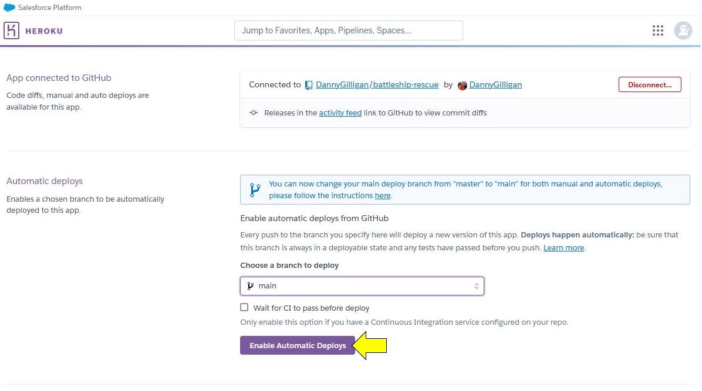

# Battleship Rescue

 
 
 

## Table of Contents

* [Introduction](#introduction)
* [Features](#features)
* [Design](#design)
* [User Stories](#user-stories)
* [Bugs](#bugs)
* [Manual Testing](#manual-testing)
* [Deployment](#deployment)
* [Technologies Used](#technologies-used)
* [Credits](#credits)
* [Acknowledgements](#acknowledgements)
 
 
 

## Introduction
 
 
 

## Features
 
 
 

## Design

An overview of the key design aspects of the project is included below.

 <!-- Container for process flows starts here -->
  
<b>Process Flows</b>

 
The diagrams below represent the process flows throughout the main phases of the game (these are best viewed in raw format).
 
 

  
<i> Phase 1: Initialise Game</i>

 

  
<i> Phase 2: User Shot</i>

 

  
<i> Phase 3: Enemy Shot</i>

 

  
<i> Phase 4: End Game</i>

 

 <!-- Container for process flows ends here -->
 
 
 

## User Stories
 
 
 

## Bugs
 
 
 

## Manual Testing
 
 
 

## Deployment

The app was deployed as a Minimum Viable Product using the Heroku platform.

  
<b>The steps for deployment are outlined here</b>

 

<!-- spacer -->

  
<i> Step 1: Create app</i>

 
In the Heroku dashboard, populate the 'App name' field and choose a region. Then click on 'Create app'.
 
<table>
<tr>
<td>

</td>
<td>
:heavy_check_mark:
</td>
</table>

<!-- spacer -->

  
<i> Step 2: App setup page</i>

 
Once the app is created, the setup page will be displayed. This page contains an overview of the data related to the app. From here, navigate to the 'Settings' tab.
 
<table>
<tr>
<td>

</td>
<td>
:heavy_check_mark:
</td>
</table>

<!-- spacer -->

  
<i> Step 3: Settings</i>

 
On the Settings page, click on the 'Reveal Config Vars' button.
 
<table>
<tr>
<td>

</td>
<td>
:heavy_check_mark:
</td>
</table>

<!-- spacer -->

  
<i> Step 4: Config vars</i>

 
In the Config Vars, add 'PORT' and '8000' in the fields as shown below. Then click 'Add'.
 
<table>
<tr>
<td>

</td>
<td>
:heavy_check_mark:
</td>
</table>

<!-- spacer -->

  
<i> Step 5: Add buildpacks</i>

 
Once the Config Vars are added, the next step is to add two buildpacks to the app. Scroll down to the Buildpacks section and click on the 'Add buildpack' button.
 
<table>
<tr>
<td>

</td>
<td>
:heavy_check_mark:
</td>
</table>

<!-- spacer -->

  
<i> Step 6: Add python buildpack</i>

 
Select the python option from the menu, then click 'Add buildpack'. To note, it is important that the python buildpack is added first <b>before</b> any other buildpack!
 
<table>
<tr>
<td>

</td>
<td>
:heavy_check_mark:
</td>
</table>

<!-- spacer -->

  
<i> Step 7: Add node.js buildpack</i>

 
Once the python buildpack is added, select the node.js buildpack from the menu and click on the 'Add buildpack' button. To note, it is important that the node.js buildpack is added <b>after</b> the python buildpack!
 
<table>
<tr>
<td>

</td>
<td>
:heavy_check_mark:
</td>
</table>

<!-- spacer -->

  
<i> Step 8: Deploy screen</i>

 
Once the buildpacks have been added (python, followed by node.js), navigate to the 'Deploy' tab.
 
<table>
<tr>
<td>

</td>
<td>
:heavy_check_mark:
</td>
</table>

<!-- spacer -->

  
<i> Step 9: Select Github</i>

 
Select Github from the 'Deployment method' options.
 
<table>
<tr>
<td>

</td>
<td>
:heavy_check_mark:
</td>
</table>

<!-- spacer -->

  
<i> Step 10: Enter repository name</i>

 
Enter the repository name in the 'Connect to Github' field as shown below, then click on the 'Seach' button.
 
<table>
<tr>
<td>

</td>
<td>
:heavy_check_mark:
</td>
</table>

<!-- spacer -->

  
<i> Step 11: Connect</i>

 
Once the repository has been located, click on the 'Connect' button.
 
<table>
<tr>
<td>

</td>
<td>
:heavy_check_mark:
</td>
</table>

<!-- spacer -->

  
<i> Step 12: Connection confirmation</i>

 
A confirmation will be displayed on the Github once the repository is connected to the Heroku app as shown below.
 
<table>
<tr>
<td>

</td>
<td>
:heavy_check_mark:
</td>
</table>

<!-- spacer -->

  
<i> Step 13: Enable automatic deploys (optional)</i>

 
Automatic deploys can be enabled if so desired by clicking on the 'Enable Automatic Deploys' button, this will result in the app being refreshed with updated code every time changes are pushed to Github. 
 
<table>
<tr>
<td>

</td>
<td>
:heavy_check_mark:
</td>
</table>

<!-- spacer -->

  
<i> Step 14: Manual deployment</i>

 
The initial deployment of the app can be triggered by selecting 'main' from the 'Choose a branch to deploy' menu, then clicking on the 'Deploy Branc' button.
 
<table>
<tr>
<td>

</td>
<td>
:heavy_check_mark:
</td>
</table>

<!-- spacer -->

  
<i> Step 15: Deployment confirmation</i>

 
Once the app build and deployment has been completed in Heroku, a confirmation will be displayed as shown below. The app can now be viewed by clicking on the 'View' button.
 
The deployment process is now complete.
 
<table>
<tr>
<td>

</td>
<td>
:heavy_check_mark:
</td>
</table>

<!-- spacer -->

 
 
 

## Technologies Used
 
 
 

## Credits

  
Reference Materials Used

 

<table>
<tr><th><b> Description </b></th><th><b> Link </b></th></tr>
<!-- Reference Material 1 begins -->
<tr><td> Code Institute README.md Tutorial by Kasia Bogucka </td>
<td> 

[here](https://www.youtube.com/watch?v=l1DE7L-4eKQ)  

</td></tr>
<!-- Reference Material 1 ends -->
<tr><td> Guide to Milestone 3 MVP by Kasia Bogucka </td>
<td> 

[here](https://www.youtube.com/watch?v=nNXmC6Tq0qw)  

</td></tr>
<!-- Spacer -->
<tr><td> Guide on code validation by Lane-Sawyer Thompson & Matt Rudge </td>
<td> 

[here](https://www.youtube.com/watch?v=wiqAvRCheKo)  

</td></tr>
<!-- Spacer -->
<tr><td> Milestone 3 Project FAQs by Lane-Sawyer Thompson & Lucy Rush </td>
<td> 

[here](https://www.youtube.com/watch?v=BDKvisxzEbk)  

</td></tr>
<!-- Spacer -->

</table>
 
 
 

  
Images

 

<table>
<tr><th><b> Thumbnail </b></th><th><b> Production File Name </b></th><th><b> Description </b></th><th><b> Source </b></th></tr>
<!-- image 1 begins -->
<tr><td>

</td>

<td>battleship-rescue-hero-image.webp</td>
<td>Hero image used for README.md</td>
<td>

[here](https://wall.alphacoders.com/big.php?i=652229)
</td>
</tr>

</table>

 
 
 

## Acknowledgements
 
 
 
 
 
 
 
 
 

## Creating the Heroku app

When you create the app, you will need to add two buildpacks from the _Settings_ tab. The ordering is as follows:

1. `heroku/python`
2. `heroku/nodejs`

You must then create a _Config Var_ called `PORT`. Set this to `8000`

If you have credentials, such as in the Love Sandwiches project, you must create another _Config Var_ called `CREDS` and paste the JSON into the value field.

Connect your GitHub repository and deploy as normal.

## Constraints

The deployment terminal is set to 80 columns by 24 rows. That means that each line of text needs to be 80 characters or less otherwise it will be wrapped onto a second line.

